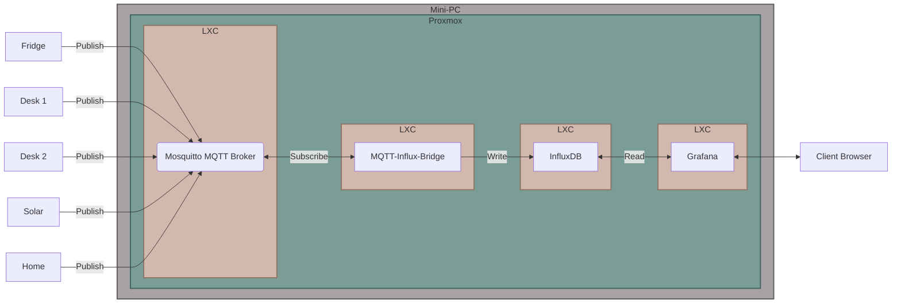

# MQTT-Influx-Bridge

This Node.js project showcases the process of receiving MQTT messages, extracting specific JSON keys, and storing them in an InfluxDB table. It utilizes my [mqttJsonParser](https://github.com/mgiesen/mqttJsonParser/tree/main) library for message reception and parsing.

## Motivation

The primary goal of this project is to provide a streamlined method for collecting sensor data from various MQTT-enabled devices in my home network and visualize it using Grafana dashboards. This eliminates the need for more resource-intensive solutions like NodeRED, offering a lightweight and customizable alternative. 

## Features

- MQTT message reception and parsing.
- JSON key extraction based on custom schema.
- Data storage in an InfluxDB database.
- Customizable subscriptions and callback functions.

## Prerequisites

- Node.js installed on your system.
- `mqtt`, `influx` and `dotenv` Node.js packages. Install using `npm install mqtt influx dotenv` if not already installed.
- MQTT broker credentials.
- InfluxDB credentials.

## Configuration file template

```bash
#INFLUX
INFLUX_HOST=
INFLUX_PORT=
INFLUX_USERNAME=
INFLUX_PASSWORD=

#MQTT
MQTT_HOST=
MQTT_USERNAME=
MQTT_PASSWORD=
MQTT_PROTOCOL=
```

## My personal setup



## My database "SMART-HOME"

### Power tracking of wifes workplace

- table desk-k-power
- table desk-k-energy-today

### Power tracking of my workplace

- table desk-m-power
- table desk-m-energy-today

### Power tracking of our fridge

- table fridge-power
- table fridge-energy-today

### Power tracking of solar

Coming soon

### Power tracking of house

Coming soon
